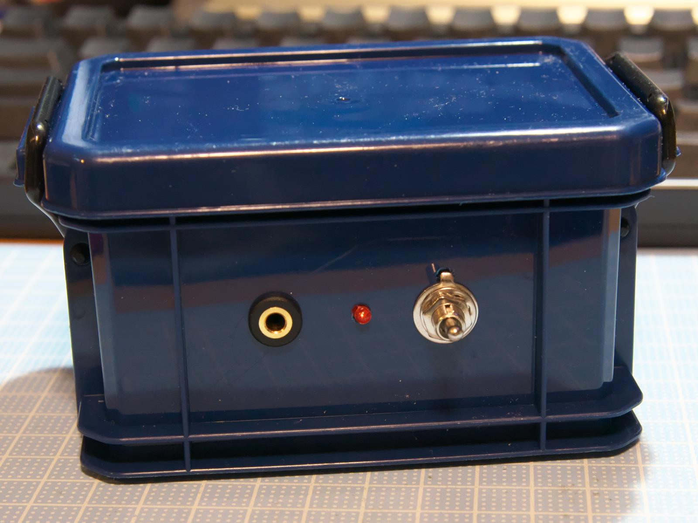
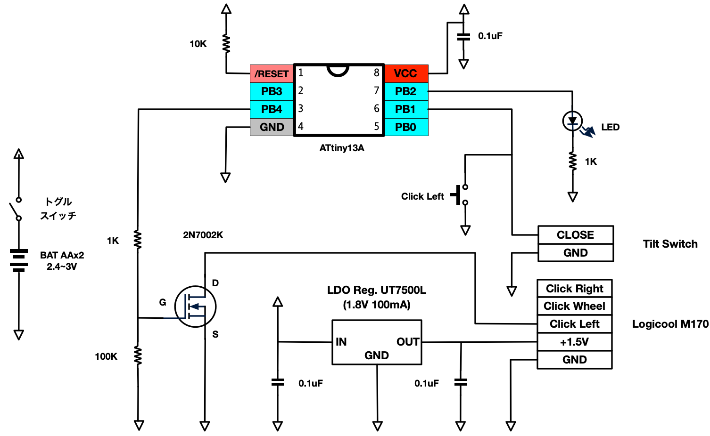
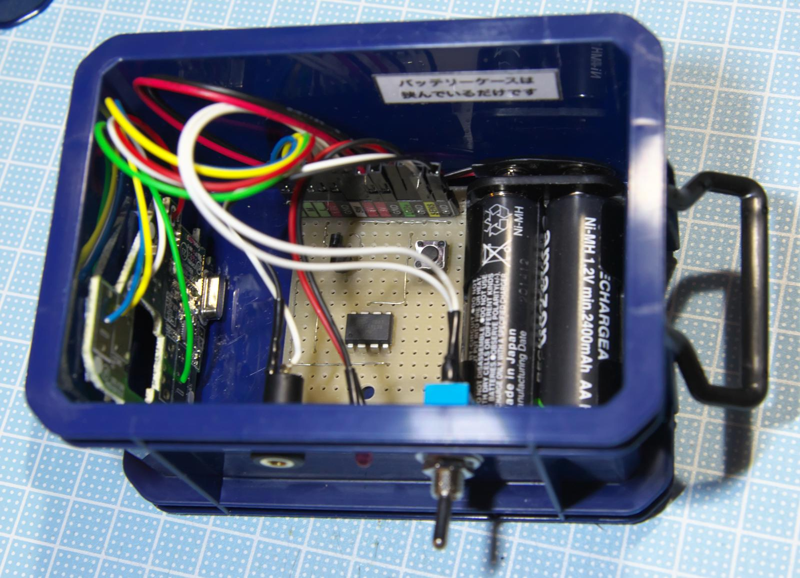
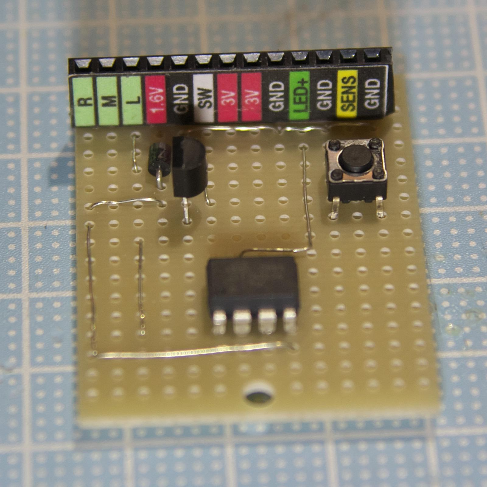
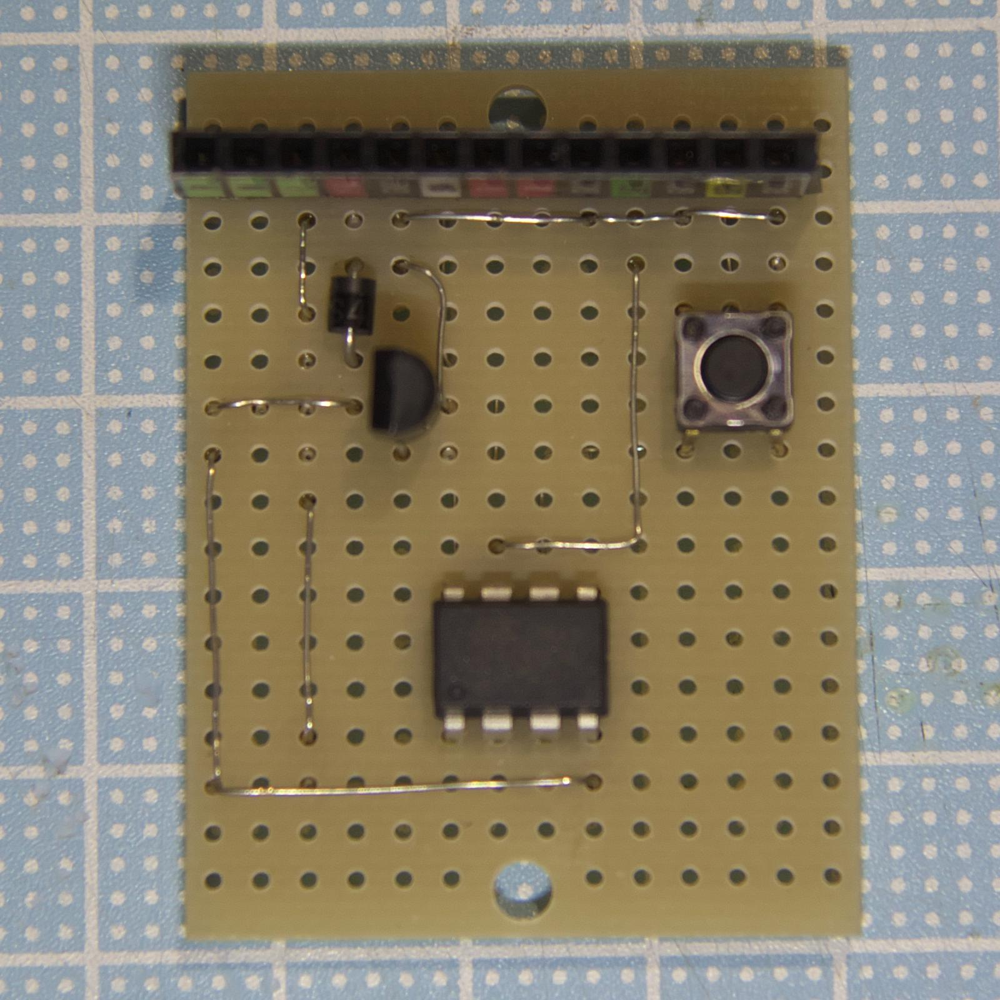
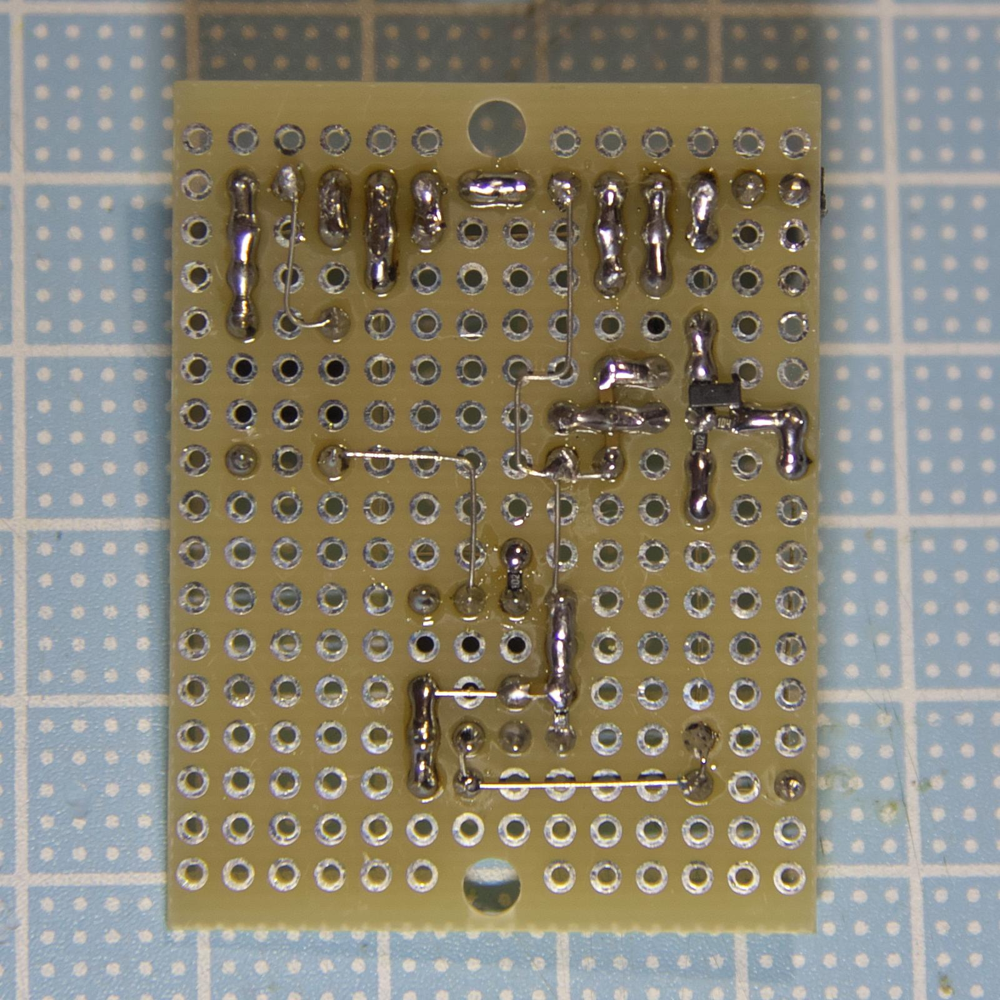

# ぐらぐらクリッカー

# 概要

* **ぐらぐらクリッカー**は傾斜をマウスクリックにする装置です。
* 切り替え時に50ms程度の無視時間をいれることで、ボールバウンドによるチャタリングを抑制します。
* Logicool M170を改造し、複雑な構成なしに無線化を実現しています。

# 使い方

マウスはLogicool M170を分解・改造して使用しています。
HIDデバイスの仕様としてはこちらに準じます。
付属のドングルをパソコンに刺して使用してください。

電池は単三電池2つで動作します。バッテリーケースは固定していません。

3.5ステレオミニジャックにセンサーに接続してください。
TipとSleeveが接触するとオンです。

ピン | 配線
-----|-----
Tip(Lch) | センサ
Ring(Rch) | 無接続
Sleeve(GND) | GND

トグルスイッチを上にすると電源オンです。
電源がオンになるとランプが高速に点滅して、その後5秒おきの点滅になります。

センサがオンになるとランプが点灯します。
基板上のボタンを押すと、センサーオンと同じ状態になります。
これで問題の切り分けができます。

# 主要構成部品

* [ATMEL(microchip) ATTiny13A](http://akizukidenshi.com/catalog/g/gI-02911/)
* [傾斜スイッチ AT-407](http://akizukidenshi.com/catalog/g/gP-02349/)
* Logicool M170

Logicook M170のスイッチはアクティブロー(GNDに落とすとオン)になっています。同じアクティブローなら別のマウスでもこのソースがそのまま使用出来ると思います。電源は1.8Vレギュレータにショットキーバリアダイオード1S4を経由して接続して1.6Vにしています。電流で若干変動します。

# 回路図

# 写真集

