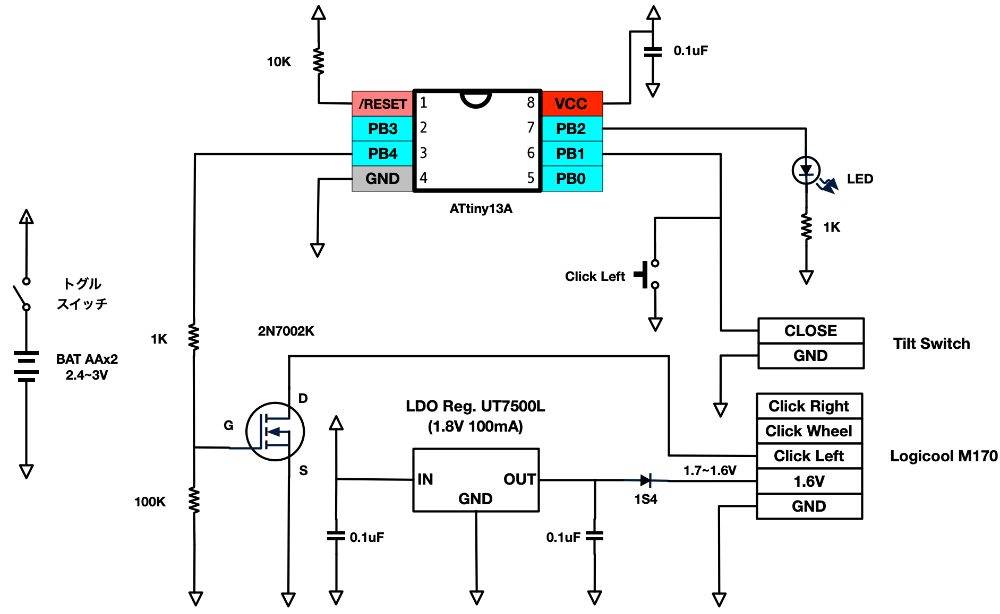

# ぐらぐらクリッカー

**ぐらぐらクリッカー**は傾斜をマウスクリックにする装置です。
切り替え時に50ms程度の無視時間をいれることで、ボールバウンドによるチャタリングを抑制します。
市販のワイヤレスマウスを改造し、複雑な構成なしに無線化を実現しています。
現在開発中です。

# 主要構成部品

* [ATMEL(microchip) ATTiny13A](http://akizukidenshi.com/catalog/g/gI-02911/)
* [傾斜スイッチ AT-407](http://akizukidenshi.com/catalog/g/gP-02349/)
* Logicool M170

スイッチがアクティブロー(GNDに落とすとオン)になっています。同じアクティブローなら別のマウスでもこのソースのままでいけるとおもいます。
電源は1.8V供給しています。

# 回路図

